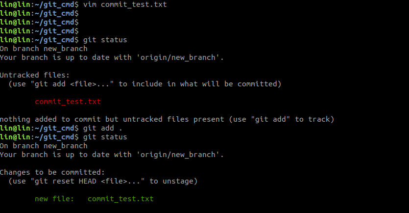

### commit 撤销提交 git reset

写完代码后，我们一般这样

```shell
git add . //添加所有文件
git commit -m "本功能全部完成"
```
执行完commit后，想撤回commit，怎么办？

``` shell
git reset --soft HEAD^
```

这样就成功的撤销了你的commit
这样做的好处是，仅仅是撤回commit操作，您写的代码仍然保留。
HEAD^的意思是上一个版本，也可以写成HEAD~1
如果你进行了2次commit，想都撤回，可以使用HEAD~2
 

#### 其他参数：
 --mixed   
意思是：不删除工作空间改动代码，撤销commit，并且撤销git add . 操作
这个为默认参数,git reset --mixed HEAD^ 和 git reset HEAD^ 效果是一样的。

--soft   
不删除工作空间改动代码，撤销commit，不撤销git add . 

 --hard  
删除工作空间改动代码，撤销commit，撤销git add . 
注意完成这个操作后，就恢复到了上一次的commit状态。

顺便说一下，如果commit注释写错了，只是想改一下注释，只需要：
git commit --amend
此时会进入默认vim编辑器，修改注释完毕后保存就好了。

1.实验  



